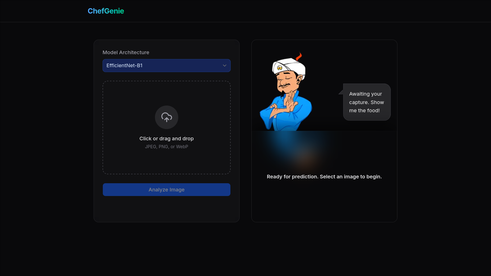
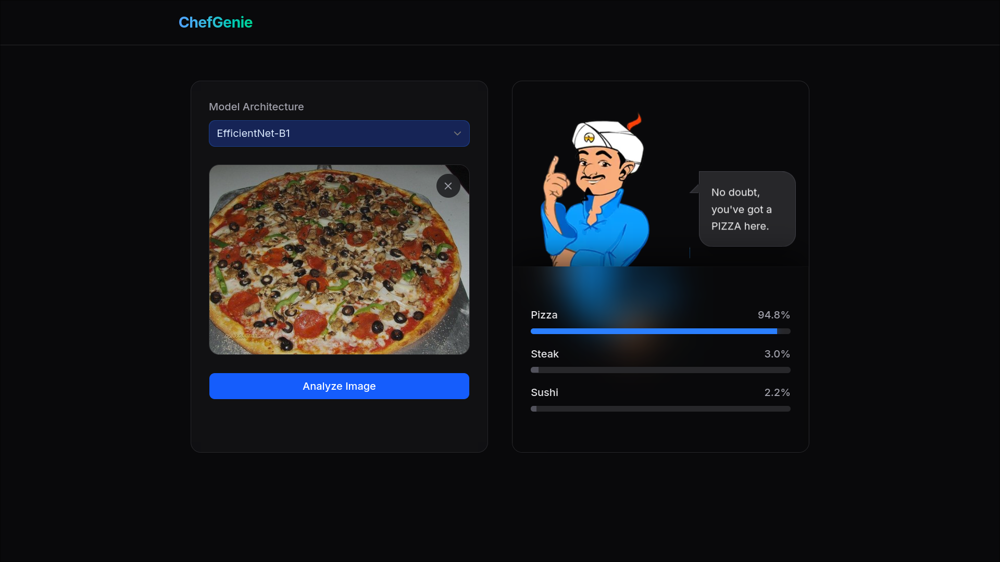

<div align="center">

# ChefGenie

**An AI-powered food classifier that turns a food photo into an instant pizza, steak, or sushi prediction.**

[](https://chef-genie-one.vercel.app/)


[Live Demo](https://chef-genie-one.vercel.app/) - [Models](#model-zoo) - [Features](#features) - [Tech Stack](#technical-stack) - [API](#api-and-backend-specification) - [Run Locally](#installation-and-development)

</div>

## Product Preview

<table>
  <tr>
    <td width="50%">
      
    </td>
    <td width="50%">
      
    </td>
  </tr>
  <tr>
    <td align="center"><strong>Upload-first workflow</strong></td>
    <td align="center"><strong>Confidence-rich prediction results</strong></td>
  </tr>
</table>

## Overview

ChefGenie is a dark, polished web application for classifying food images into three categories: **pizza**, **steak**, and **sushi**. The frontend delivers a smooth upload and results experience, while a remote transfer-learned EfficientNet backend hosted on Hugging Face Spaces handles inference.

The app is designed around a simple flow: choose an EfficientNet model variant, upload a food image, send it to the model endpoint, and receive a confidence breakdown with an animated assistant-style response.

## Model Zoo

The trained EfficientNet variants are published on Hugging Face:

| Model | Hugging Face repository |
| --- | --- |
| EfficientNet-B1 | [Shad0wKillar/efficientnet-b1](https://huggingface.co/Shad0wKillar/efficientnet-b1) |
| EfficientNet-B3 | [Shad0wKillar/efficientnet-b3](https://huggingface.co/Shad0wKillar/efficientnet-b3) |
| EfficientNet-B5 | [Shad0wKillar/efficientnet-b5](https://huggingface.co/Shad0wKillar/efficientnet-b5) |
| EfficientNet-B7 | [Shad0wKillar/efficientnet-b7](https://huggingface.co/Shad0wKillar/efficientnet-b7) |

## Features

- **EfficientNet model selection**: Switch between available model variants before running inference.
- **Drag-and-drop image upload**: Upload food images through a dedicated drop zone with click-to-select fallback behavior.
- **Remote AI inference**: Send multipart image payloads directly to a hosted Hugging Face Spaces prediction endpoint.
- **Cold-start aware status updates**: Show users a secondary loading state when the backend container needs time to initialize.
- **Visual confidence breakdown**: Display class probabilities with readable labels, percentages, and progress indicators.
- **Animated dark UI**: Use Framer Motion, Lucide icons, and Tailwind CSS for a responsive interface with polished micro-interactions.

## Technical Stack

| Layer | Technology |
| --- | --- |
| Framework | Next.js 16 App Router |
| UI Library | React 19 |
| Language | TypeScript 5 |
| Styling | Tailwind CSS v4 |
| Motion | Framer Motion |
| Components | Radix UI, shadcn, Lucide React |
| Package Manager | pnpm |
| Model Backend | Transfer-learned EfficientNet on Hugging Face Spaces |

## Directory Structure

```text
src/app/page.tsx
  Main application screen, layout composition, and top-level UI flow.

src/hooks/use-prediction.tsx
  Prediction state, selected model, loading lifecycle, and backend requests.

src/components/image-upload.tsx
  Drag-and-drop upload handling, file preview, and input validation surface.

src/components/model-selector.tsx
  EfficientNet variant selector.

src/components/genie-response.tsx
src/components/results-display.tsx
  Assistant response messaging and classification confidence visualization.

assets_github/*.png
  README screenshots and project preview assets.
```

## Installation and Development

### Prerequisites

- Node.js
- pnpm

### Run Locally

```bash
pnpm install
pnpm dev
```

Open `http://localhost:3000` in your browser.

### Production Build

```bash
pnpm build
pnpm start
```

## API and Backend Specification

The client communicates with a deployed model endpoint using multipart form data.

| Field | Value |
| --- | --- |
| URL | `https://shad0wkillar-efficientnet-transferlearned.hf.space/predict` |
| Method | `POST` |
| Query parameter | `model_type` |
| Supported model examples | `b1`, `b3`, `b5`, `b7` |
| File field | `file` |

### Request Payload

```ts
const formData = new FormData();
formData.append("file", imageFile);
```

### Response Payload

The backend returns confidence scores for the supported food classes:

```json
{
  "pizza": 0.852,
  "steak": 0.114,
  "sushi": 0.034
}
```

## License

This project is released under the license included in [LICENSE](./LICENSE).
